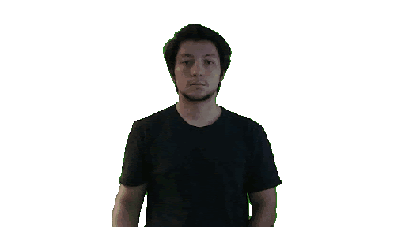
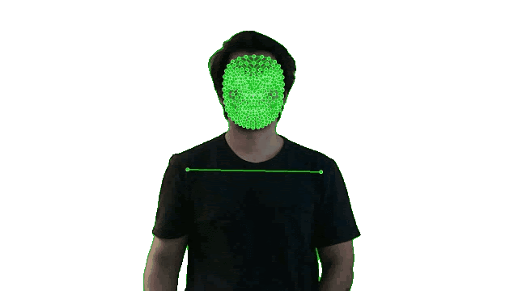

# **DEEP LEARNING PARA RECONHECIMENTO DE SINAIS DA LIBRAS COMO TECNOLOGIA ASSISTIVA**
#### Esse repositório tem como objetivo disponibilizar abertamente os códigos, recursos e conhecimentos utilizados durante o meu Trabalho de Conclusão de Curso para Engenharia de Computação na Universidade Federal de Goiás, conforme sua publicação na [Biblioteca Virtual](https://repositorio.bc.ufg.br/items/b45972e2-0553-4d9b-bc35-fe75f31df09d).
---

  
  

---
#### Recomendação de Leitura para Compreensão: [Apresentação do Projeto](docs/apresentacao_tcc.pdf)
## Visão Geral

Este projeto implementa uma pipeline completa para **reconhecimento/classificação de sinais em LIBRAS** e sua **tradução para o português escrito**, usando **Deep Learning** a partir de vídeos. O trabalho cobre desde a **construção/ampliação da base** até o **treinamento e comparação de modelos** com diferentes estratégias de pré-processamento e alinhamento temporal.

### 1) Base de dados (vídeos)
- Foi utilizada a base pública **MINDS-LIBRAS** (20 sinais, 1.200 vídeos, 12 sinalizadores). :contentReference[oaicite:1]{index=1}  
- Para aumentar diversidade e volume, foram adicionadas **gravações autorais** com os mesmos 20 sinais (2 sinalizadores, 2.000 vídeos), totalizando **3.200 vídeos (160 por sinal)**. :contentReference[oaicite:2]{index=2}  

### 2) Extração de características (landmarks)
Em vez de processar pixels diretamente, os vídeos passam por extração de **pontos-chave corporais (landmarks)** com **MediaPipe**, reduzindo o problema para séries temporais numéricas (coordenadas) que representam mãos e articuladores do corpo.

### 3) Tratamento dos dados e alinhamento temporal
Como os sinais variam em duração (quantidade de frames), os dados foram transformados em tensores e **alinhados** com três abordagens:
- **Interpolação** (padronização do comprimento via reamostragem)
- **Padding** (preenchimento com zeros/máscaras)
- **DTW (Dynamic Time Warping)** (alinhamento dinâmico entre sequências)

A comparação considera também o impacto dessas escolhas no **custo computacional** (tempo) e no comportamento de **overfitting**.

### 4) Modelos treinados e comparação
Foram arquitetados e comparados dois modelos para classificação dos sinais:
- **LSTM** (modelo sequencial recorrente)
- **Sign Action Transformer** (modelo baseado em Transformers)

O estudo avalia como **modelo + método de alinhamento** influenciam desempenho e custo.

### 5) Treinamento e métricas
- Split: **80% treino / 20% validação**.
- Métricas principais: **Accuracy** e **Loss**, acompanhadas por gráficos por época e **matriz de confusão** para entender erros entre classes semelhantes.

### Conclusão
- O **Transformer** foi o melhor no geral (alta acurácia e melhor generalização), porém com **maior demanda computacional**.
- O **LSTM** teve bom custo-benefício (mais leve/rápido), mas mostrou limitações conforme a complexidade cresce.
- Entre os alinhamentos, a **interpolação** se destacou como a abordagem mais eficaz (melhorando predição e reduzindo overfitting nos modelos). 
- A maior limitação do trabalho foi a **dificuldade de formar uma base rica e robusta** (escassez de dados em LIBRAS), apontando que expandir diversidade/volume é essencial para generalizar para cenários mais complexos.
